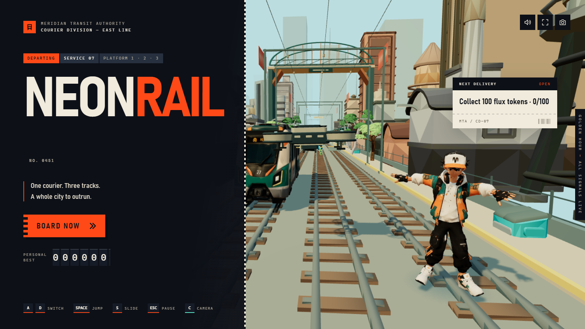
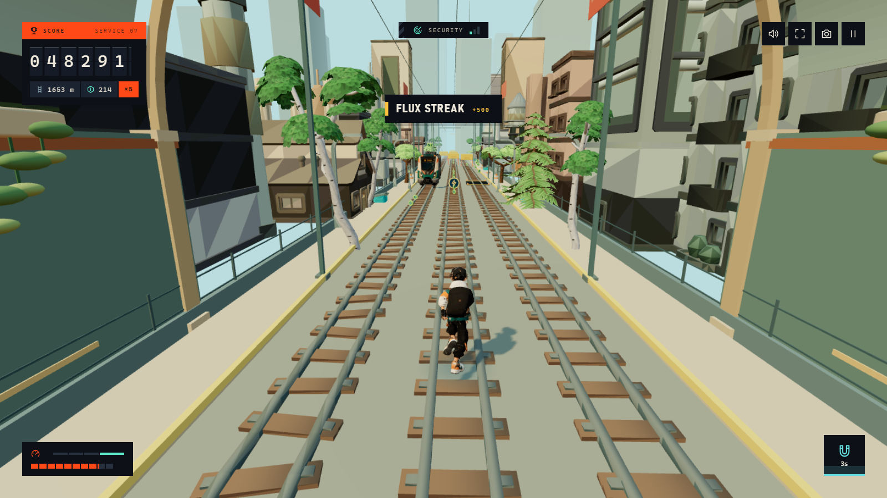
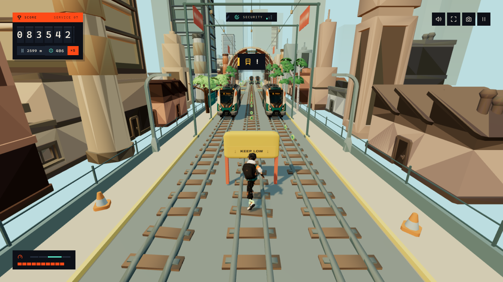
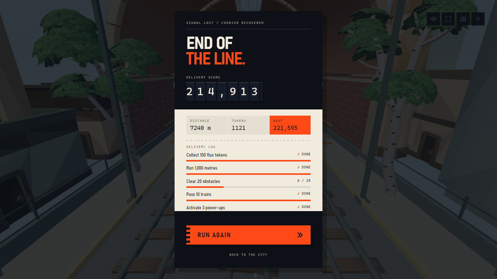

# NEON RAIL

A three-lane endless runner that runs in a browser tab — and plays from your webcam.

Jog in place to run. Lean to change lanes. Hands up to jump, squat to slide.
Or just use the keyboard. Pose estimation happens on your own machine, in a
Web Worker; no video ever leaves the device, and once the page has loaded the
game makes **no network requests at all**.

Built on Three.js. No game engine, no framework, ~2,000 lines of source.

**▶ [Play it in your browser](https://neon-rail-gurus-projects-0640c5c1.vercel.app)**  ·  Chrome, Edge or Firefox on desktop



## Playing

| | |
|---|---|
| `A` `D` / `←` `→` | Change lane — works mid-air |
| `W` / `↑` / `Space` | Jump |
| `S` / `↓` | Slide. In the air, drops you fast |
| `Esc` | Pause |
| `C` | Camera control |
| `M` / `F` | Sound / fullscreen |

Mint hexagons are flux tokens, and a ribbon of them traces a lane that is
always open. Yellow barriers get jumped, **KEEP LOW** signs get slid under,
and full-height trains can't be cleared from the ground — switch lanes, or
take a gold ramp onto the roof. Incoming trains sound a horn first.



### Camera control

Press `C`. Two modes:

- **Full body** — jog in place to move, lean left or right to change lanes,
  raise both hands to jump, squat to slide. Stand still and you stop running,
  which security notices.
- **Head only** — for seated play. Lean to steer, rise to jump, duck to slide.

The tracker wants your head, knees and ankles inside the frame. It calibrates
on whatever posture you hold still in, so there is no "correct" starting pose,
and `R` re-centres whenever you have drifted.

The pose model and the MediaPipe WASM are only fetched when you actually turn
the camera on. Keyboard players never download them.

## Running it locally

```bash
npm install
npm run dev
```

That builds and serves on <http://127.0.0.1:8765>. On Windows you can
double-click `PLAY.cmd` instead.

The MediaPipe runtime for camera control isn't committed — it's ~17 MB of
unmodified upstream files — so the build stages it on the first run, fetching
the WASM from the npm package and the two models from Google's model host.
Everything else, models and audio included, is already in the repo. There is no
asset server and no account.

```bash
npm test     # three dependency-free Node suites
npm run build # writes public/
```

## How it works

### The track is generated, then proved survivable

Each "gate" blocks two of three lanes and leaves one open. The interesting
part is the space between gates, which used to be 70–85 m of nothing — five
seconds of free running at starting speed. That corridor now carries obstacles
you clear with a **reflex rather than a lane change**: jump the hurdle, slide
under the sign.

Packing that corridor is only fair because of two invariants, both enforced in
`validatePattern` and checked by the tests:

- **One demand per gap.** A gap is all hurdles or all signs, held for four
  gates at a time. Mixing them is what makes runners feel cheap — a jump arc
  is 37 m at top speed, longer than the corridor, so you would still be
  airborne when a sign arrived with no way down.
- **A run of hurdles fits inside one jump.** You are above hurdle height from
  0.086 s to 0.94 s after take-off — a 30.7 m window at top speed — so hurdle
  runs are capped at 26 m. Without this, clearing the first hurdle lands you
  on top of the third.

At most two of the three lanes are ever blocked at one point, so a player who
misses the input entirely still has somewhere to step. **720,000 generated
patterns** validate clean.

I found the second invariant by pointing a scripted bot at the game and
reading what killed it: 28 deaths from being airborne over a hurdle. After
the cap, median bot distance went from 2.2 km to 3.5 km and those deaths
disappeared.



*Both outer lanes blocked by trains, and the one open lane costs you a slide.*

### Turning a webcam into a gamepad

Raw landmark positions are far too noisy to drive lane changes. The signal
path is:

1. **Median of three** — kills single-frame spikes without the lag a longer
   window costs.
2. **One Euro filter** ([Casiez et al., CHI 2012](https://gery.casiez.net/1euro/))
   — a fixed low-pass filter forces a choice between jitter while still and
   lag while moving. This one raises its cutoff with speed, so it is calm at
   rest and responsive on a deliberate lean.
3. **Hysteresis, dwell and cooldown** — entering a lane needs a bigger lean
   than holding it, the lean has to persist, and a fired gesture has to return
   to neutral before it can fire again.

Thresholds are expressed in head-widths rather than pixels, so they hold
whether you're sitting near the camera or standing back from it.

Inference runs in a Web Worker fed by `MediaStreamTrackProcessor`, so frames
never touch the main thread and a slow inference throttles itself instead of
queueing. Pose costs about 20 ms a frame against 7.6 ms for face-only, which
is why head-only mode exists.

### Art pipeline

Nothing in `assets/` is hand-modelled. `tools/` turns CC0 kits and generated
meshes into something a browser can hold at 60 fps:

- Kenney kits use a flat colour-swatch texture, so every triangle samples one
  pixel. The pipeline splits each model by swatch, retints it, and bakes the
  result into vertex colours — a 95-model kit collapses to **8 materials and
  one draw call per model**, and no texture ships at all.
- Meshy generations are decimated with `meshoptimizer`'s
  `simplifyWithAttributes`. The `Permissive` flag matters: these meshes are
  hundreds of detached shells, and without it simplification floors out around
  8.2k triangles.
- Eleven Mixamo clips are merged onto **one** skeleton by bone name, with root
  motion stripped — the game controls position, the animation controls the
  body, never both.

### Sound

Effects are synthesised at runtime; there are no samples. The three music
tracks arrived at −12.4 LUFS peaking at +0.5 dBFS — loudness-war masters that
were already clipping — and are normalised at build time to **−18 LUFS with a
−1.5 dBTP ceiling** (EBU R128, two-pass). All three land within 0.0 LU of each
other, so switching tracks never jumps in volume.

The bed sits at 0.15 linear, which puts it about **9 dB under** the cues you
have to react to, and ducks a further 4 dB while a horn or an impact is
sounding. Tracks shuffle per run, never opening on the one the last run ended
with, and cross-fade equal-power into each other until you lose.



## Layout

```
src/        the game — rendering, physics, generation, camera control, UI
assets/     packed GLBs and audio (the pipeline's output, not its input)
tests/      three Node suites, no dependencies
tools/      the asset pipeline, plus the MediaPipe staging script
docs/       screenshots, and the interface design canvas
public/     build output (generated)
```

`src/core.js` is the piece worth reading first: movement physics, the pattern
generator and its safety invariants, and the save format — all of it free of
Three.js and the DOM, which is why the tests need no browser.

## Credits and licence

Code is MIT. The art, animation, audio and libraries it ships with have their
own terms, all listed in [CREDITS.md](CREDITS.md) — Kenney and Quaternius
(CC0), Google MediaPipe (Apache 2.0), Three.js (MIT), and Mixamo under Adobe's
royalty-free project licence.
